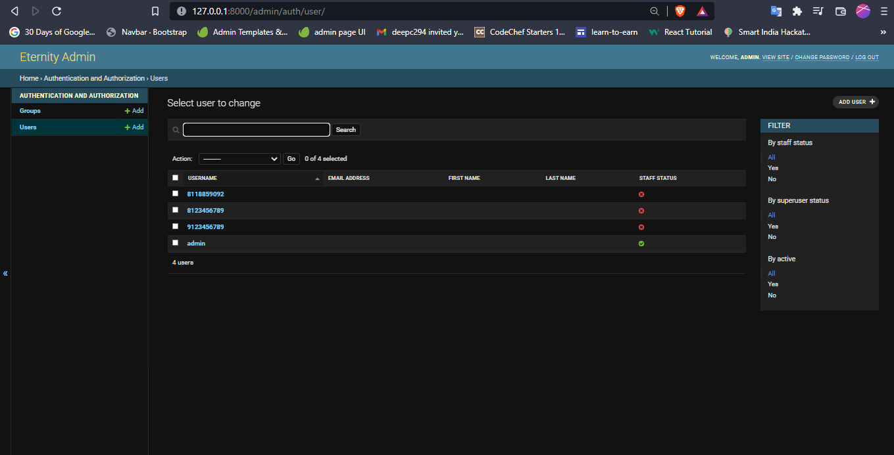

# movie_recommendation_system
Identifes the users interest and recommendes the movie, and make a to_do list to watch one after another


BASIC OVERVIEW
________________________


Clone this repo to your local machine.

```bash
  $ python manage.py runserver
```
Go to localhost:8000

_______________________
## Features

- User can register and login.
- User can search through various movies and look through its details.
- User can get movie recommendation (Recommendation by the user domain categories which suggests new movies based on the interest of user.)
- User can add movie to their watch list.

__________________________________________________

#Approach
As the  user logins in the website its entry is creayed in the database with its unique id  
## Login page

</br>
After login the user is asked to make a profile in which the user is asked to fill its Profile Picture ,Name ,Interest(Domain) ,Phone Number , Email-Address
## Profile Page

</br>
After successfull creating the entries {A user has successfully logged in }
## Database

</br>
Now the User can see the Dashboard which is accessed through the created unique id created by the user in the database during the time of log in
## Dashboard

</br>
After log in the user can explore other genre other then the user interest so other categories are also available
## categories

And a specially customised to do list is being generated by the unique id of the user in which the movies according to the users genre or interest is generated and ready to be used and also gets updated as the user watches the other or mixed genre movies to give the most likely to be watched movies and a better list to go with 
## to do list

</br>

__________________________________________________
## Tech Stack

**Client:** HTML 5, CSS, javascript

**Server:** Python in django framework

