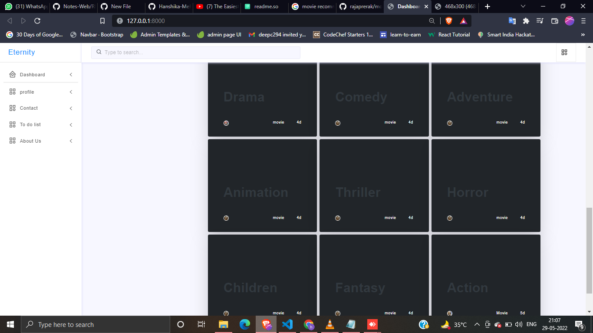

# movie_recommendation_system
Identifes the users interest and recommendes the movie, and make a to_do list to watch one after another


BASIC OVERVIEW
________________________


Clone this repo to your local machine.

```bash
  $ python manage.py runserver
```


_______________________

__________________________________________________
As the logins in the website 
## NEW

</br>
## ADD 1

</br>
## View

</br>
## ADD 2

</br>
## Search

</br>

